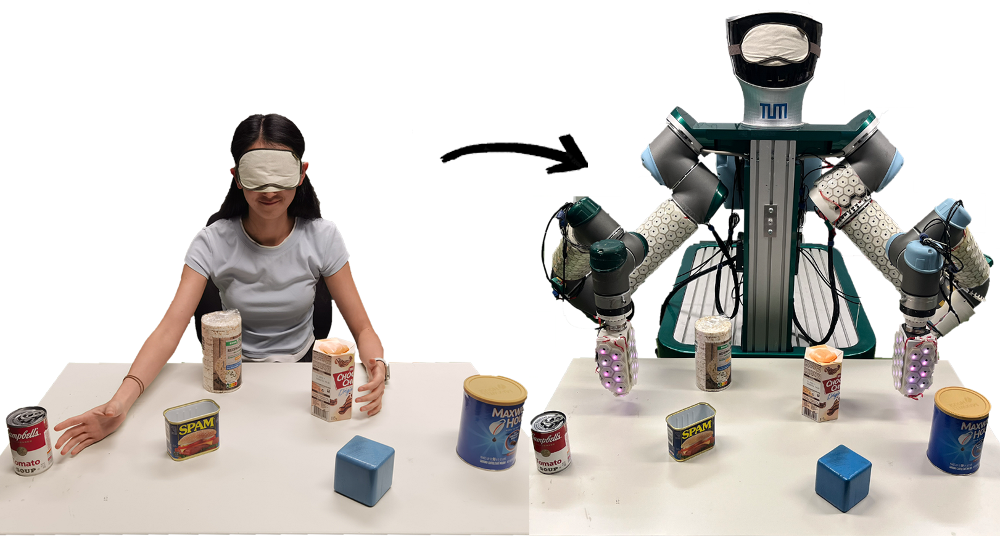
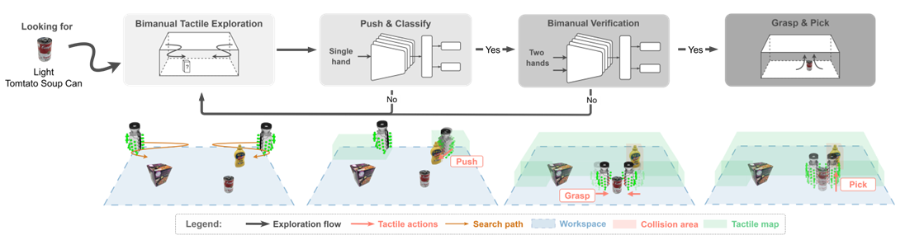

<div align="center">


<h3>Bimanual Object Blind Search and Retrieval via Tactile-Only Feedback</h3>

[](https://ieeexplore.ieee.org/abstract/document/11696735)
[](https://tactile-hide-and-seek.github.io/)
[](https://huggingface.co/datasets/TUM-ICS/Hide-and-Seek)
[](https://huggingface.co/TUM-ICS/HAS-Bench-baselines)



<em>From human blind search to tactile-only bimanual robot retrieval.</em>

</div>

This repository provides a minimal public release for loading the Hugging Face dataset, creating temporal windows, training a PyTorch dual-head baseline, and evaluating checkpoints.

<p align="center">
  
  <br>
  <em>Overview of the Tactile Hide-and-Seek framework.</em>
</p>

## Links

- Dataset: https://huggingface.co/datasets/TUM-ICS/Hide-and-Seek
- Pretrained checkpoints: https://huggingface.co/TUM-ICS/HAS-Bench-baselines
- Project page: [tactile-hide-and-seek](https://tactile-hide-and-seek.github.io/)
- Paper: [IEEE Xplore](https://ieeexplore.ieee.org/abstract/document/11696735)

## Installation

```bash
conda create -n thas python=3.10 -y
conda activate thas
pip install -e ".[dev]"
```

## Dataset

```python
from datasets import load_dataset

dataset = load_dataset("TUM-ICS/Hide-and-Seek")
```

The dataset is frame-wise with fixed train/validation/test splits. The baseline trains on temporal windows (`window_length=100`, `stride=40`) grouped by `episode_index`; windows never cross episode boundaries.

## Training

```bash
python scripts/train.py --config configs/baseline_m12345.yaml --output_dir checkpoints/m12345
python scripts/train.py --config configs/baseline_m123.yaml   --output_dir checkpoints/m123
```

Modalities can also be selected directly, e.g. `python scripts/train.py --modalities M23`.

## Evaluation

Download the pretrained checkpoints (or reproduce them with the training commands above):

```bash
hf download TUM-ICS/HAS-Bench-baselines --local-dir checkpoints
```

```bash
python scripts/eval.py           --checkpoint checkpoints/m12345/best_model.pt --split test
python scripts/eval_retrieval.py --checkpoint checkpoints/m12345/best_model.pt --split test --hard_negatives
python scripts/eval_early.py     --checkpoint checkpoints/m12345/best_model.pt --split test
```

All evaluation scripts fix the random seed (`--seed`, default 42) and can write machine-readable summaries with `--results_json`. Reference outputs are provided under [`results/`](results/).

## Labels

`data/label_mapping.json` and `data/label_mapping.yaml` map the 61 object-weight labels to 34 object labels and 4 weight labels (`none`, `light`, `medium`, `heavy`), e.g. `bag_medium -> object=bag, weight=medium`.

## Citation

```bibtex
@inproceedings{fu2026tactilehideandseek,
  title     = {Tactile Hide and Seek: Bimanual Object Blind Search and Retrieval via Tactile-Only Feedback},
  author    = {Fu, Xiangyu and Xing, Hao and Armleder, Simon and Shen, Wenlan and Wang, Fengyi and Guadarrama-Olvera, Julio Rogelio and Cheng, Gordon},
  booktitle = {2026 IEEE International Conference on Robotics and Automation (ICRA)},
  year      = {2026},
  pages     = {21617-21624},
  doi       = {10.1109/ICRA57385.2026.11696735}
}
```

## Contact

[Xiangyu Fu](mailto:xiangyu.fu@tum.de)
